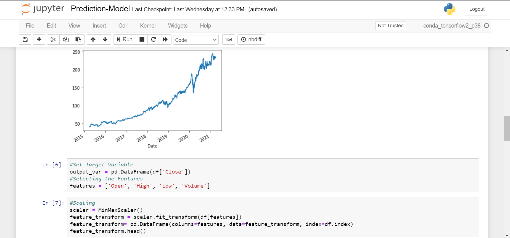

# Cloud Computing Project

## Problem Statement
  Develop an application using at least 4 services provided by any one of the cloud service providers.

## Overview of the project
Aim of this project is to make use of Amazon Web Services to build a model which predicts the stock prices based on historical data. 
The need to be able to correctly predict prices of stocks of various companies is always a challenge for day and swift traders who totally depend on these price fluctuations in order to earn their basic living.
Therefore, an accurate model is required to predict their opening and closing prices.
The LSTM (Long Short-Term Memory) Networks in Machine Learning are an amazing way of predicting these prices. Primarily, they work due to two main reasons, first, they can store past information and secondly, they forget useless information. A combination of these two things results in a model which has proven to be very effective in sequence prediction problems.

## Services Used
 ### EC2
 It is used to generate a key pair for authentication purposes in CodeStar and also, Jupyter NB of Sagemaker requires EC2 in order to run.
 ### Sagemaker
 The Jupyter notebook instance of Sagemaker contains the python code for LSTM model which is used to predict the prices.
 ### CodeStar
 CodeStar is used to quickly build and deploy applications and in our case it is used to build the application.
 ### S3 Bucket
 It is the data store of AWS which is used to store the historical datasets on which the model is trained.
 ### CodeCommit
 Similar to GitHub, it is used as a version control tool.
 ### AWS Amplify
 AWS Amplify is used to connect to GitHub/CodeCommit repository and then deploy the static website.

## Sagemaker NB Screenshots
  

    
  

  

    
  

  

    
  

  

    
  

  

    
  

  

    
  

  

    
  

  

    
  

  

    
  

  
 ## Output Graph
 

    
  

